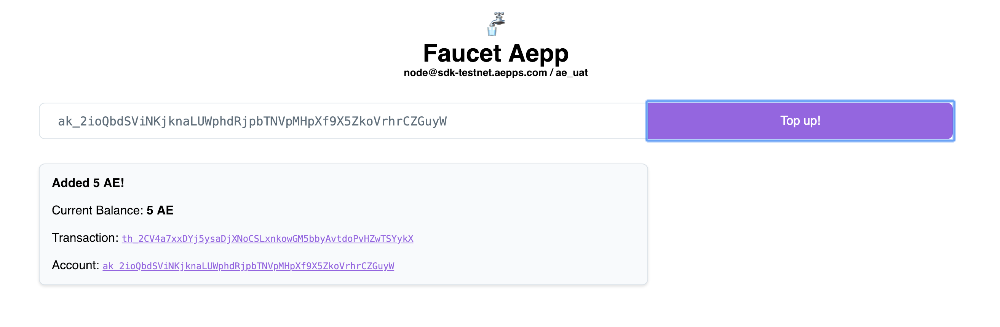

# aepp-sdk-python

## Introduction

[This repo](https://github.com/aeternity/aepp-sdk-python) is for developing apps for the æternity blockchain in Python. Please see the [main dev site](https://dev.aepps.com) for instructions on accessing the testnet, and for running a local æternity node.

## Installation

The SDK required Python 3. For out of the box use, it is recommended to use
`venv` and install dependencies into it.

```
python3 -m venv venv
source venv/bin/activate
pip install aepp-sdk
```

Whenever you come back, don't forget to run `source venv/bin/activate`, again.

## CLI Usage

See below for programmatic usage

You can launch the command line tool using

```
./aecli
```

Available commands:

```
Usage: aecli [OPTIONS] COMMAND [ARGS]...

  Welcome to the aecli client.

  The client is to interact with an node node.

Options:
  --version            Show the version and exit.
  -u, --url URL        Node node url
  -d, --debug-url URL
  --force              Ignore node version compatibility check
  --wait               Wait for transactions to be included
  --json               Print output in JSON format
  --version            Show the version and exit.
  --help               Show this message and exit.

Commands:
  account  Handle account operations
  chain    Interact with the blockchain
  config   Print the client configuration
  inspect  Get information on transactions, blocks,...
  name     Handle name lifecycle
  oracle   Interact with oracles
  tx       Handle transactions creation
```

## Environment variables

Use the environment variables

- `EPOCH_URL` 
- `EPOCH_URL_DEBUG`

### Example usage

The following is a walkthrough to execute an offline spend transaction on the *sdk-edgenet* network

1. Set the environment variables
```
export EPOCH_URL=https://sdk-testnet.aepps.com
export EPOCH_URL_DEBUG=https://sdk-testnet.aepps.com
```

❗ When not set the command line client will connect to mainnet

2. Retrieve the top block
```
./aecli chain top
<none>
  Beneficiary _______________________________________ ak_2iBPH7HUz3cSDVEUWiHg76MZJ6tZooVNBmmxcgVK6VV8KAE688
  Hash ______________________________________________ kh_2CkQuFZbxMh7KEjWQYphWxaTsTaL1tXrMDLyDwikKbwG1jNuRL
  Height ____________________________________________ 12465
  Miner _____________________________________________ ak_q6LAEutWqrmMLvSWE1dG4hN3dmLb8ixsJnkZUhsybGEti7Biv
  Nonce _____________________________________________ 13307153327850546964
  Prev hash _________________________________________ kh_oNMbgX3jW55tg3cr1DMpniCNfrJgQuqQUFEsXaozfhTca4rJt
  Prev key hash _____________________________________ kh_oNMbgX3jW55tg3cr1DMpniCNfrJgQuqQUFEsXaozfhTca4rJt
  State hash ________________________________________ bs_LaWiuHdYQ7Z1KBxXMeaPtYCG7JeCWU6ZqxfsGLTxYJU9cbsRq
  Target ____________________________________________ 538660660
  Time ______________________________________________ 2018-12-23T22:15:34.290000+00:00
  Version ___________________________________________ 1
</none>
```

3. Create a new account

```
aecli account create TEST.json
Enter the account password []:
<account>
  Address ___________________________________________ ak_tMZTyGmbpZYdKde9pfjh8bnxD2PPEEXM4KQjarLNNaoPpwrxn
  Path ______________________________________________ /..../TEST.json
</account>
```

❗ Make sure that you use a long and difficult-to-guess password for an account that you plan to use on mainnet

4. Go to [testnet.faucet.aepps.com](https://testnet.faucet.aepps.com) and top up your account



5. Inspect the transaction reported by the faucet app
```
aecli inspect th_2CV4a7xxDYj5ysaDjXNoCSLxnkowGM5bbyAvtdoPvHZwTSYykX
<transaction>
  Block hash ________________________________________ mh_2vjFffExUZPVGo3q6CHRSzxVUhzLcUnQQUWpijFtSvKfoHwQWe
  Block height ______________________________________ 12472
  Hash ______________________________________________ th_2CV4a7xxDYj5ysaDjXNoCSLxnkowGM5bbyAvtdoPvHZwTSYykX
  <signatures 1>
    Signature #1 ____________________________________ sg_WtPeyKWN4zmcnZZXpAxCT8EvjF3qSjiUidc9cdxQooxe1JCLADTVbKDFm9S5bNwv3yq57PQKTG4XuUP4eTzD5jymPHpNu
  <tx>
    Amount __________________________________________ 5000000000000000000
    Fee _____________________________________________ 20000
    Nonce ___________________________________________ 146
    Payload _________________________________________ Faucet Tx
    Recipient id ____________________________________ ak_2ioQbdSViNKjknaLUWphdRjpbTNVpMHpXf9X5ZkoVrhrCZGuyW
    Sender id _______________________________________ ak_2iBPH7HUz3cSDVEUWiHg76MZJ6tZooVNBmmxcgVK6VV8KAE688
    Ttl _____________________________________________ 12522
    Type ____________________________________________ SpendTx
    Version _________________________________________ 1
  </tx>
</transaction>
```

6. Create another account

```
aecli account create TEST1.json
Enter the account password []:
<account>
  Address ___________________________________________ ak_2rT82n7BYbH9JCsgxWqJc4BbPb9UybxCeAGS2RtXc8pPxhWJDu
  Path ______________________________________________ /..../TEST1.json
</account>
```


7. Transfer some tokens to an account to the other

```
aecli account spend TEST.json ak_2rT82n7BYbH9JCsgxWqJc4BbPb9UybxCeAGS2RtXc8pPxhWJDu 1000000000000000000 --network-id ae_uat  
Enter the account password []:
<spend transaction>
  Sender account ____________________________________ ak_2ioQbdSViNKjknaLUWphdRjpbTNVpMHpXf9X5ZkoVrhrCZGuyW
  Recipient account _________________________________ ak_2rT82n7BYbH9JCsgxWqJc4BbPb9UybxCeAGS2RtXc8pPxhWJDu
  Unsigned __________________________________________ tx_+FcMAaEB4pu+lXqNvHL+V7e1uq4GhGOTR6GA6xF1LNzT1sp/De6hAfP6rN+zuBu1JJBSjeuEBufFkXQ1fRK0iYsik1KyXgWWiA3gtrOnZAAAgk4ggjKtAYANBwQ3
  Signed ____________________________________________ tx_+KELAfhCuEBlJaNys8hURnXUAqVYsmgjSApQh7PbGm+r4KoJQwUH+zU+0z2+Y+Q/ecU/bdBvwqO7UcOyVnWlvVEoDFLUXfAFuFn4VwwBoQHim76Veo28cv5Xt7W6rgaEY5NHoYDrEXUs3NPWyn8N7qEB8/qs37O4G7UkkFKN64QG58WRdDV9ErSJiyKTUrJeBZaIDeC2s6dkAACCTiCCMq0BgBH1MuI=
  Hash ______________________________________________ th_2PbPcfBMJGXe4GeAYWVT1CiY3DocgAe1RPP47VP1xaU2X5quJd
</spend transaction>
```

❗ You dont need to set the `network-id` parameter for the mainnet!

8. Verify the balance of the new account
```
aecli inspect ak_2rT82n7BYbH9JCsgxWqJc4BbPb9UybxCeAGS2RtXc8pPxhWJDu
<account>
  Balance ___________________________________________ 1000000000000000000
  Id ________________________________________________ ak_2rT82n7BYbH9JCsgxWqJc4BbPb9UybxCeAGS2RtXc8pPxhWJDu
  Nonce _____________________________________________ 0
</account>
```


## Advanced usage

For advanced usage check the [documentation](docs).


## Reference:

[AENS API Spec](https://github.com/aeternity/protocol/blob/master/node/api/naming_system_api_usage.md)

[AENS Protocol](https://github.com/aeternity/protocol/blob/master/AENS.md)
