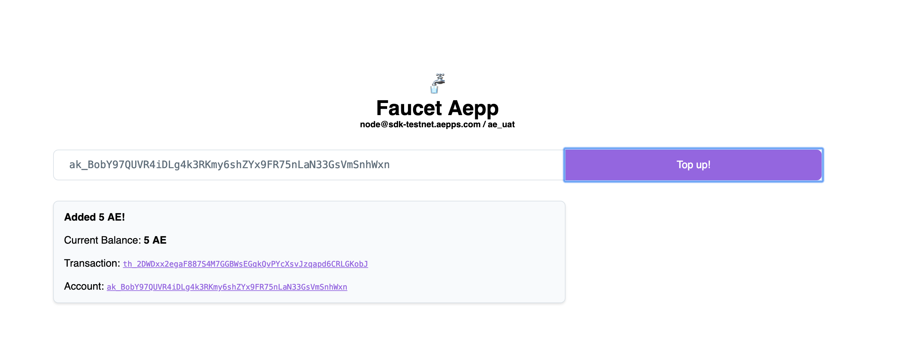

# aepp-sdk-python

## Introduction

[This repo](https://github.com/aeternity/aepp-sdk-python) is for developing apps for the æternity blockchain in Python. Please see the [main dev site](https://dev.aepps.com) for instructions on accessing the testnet, and for running a local æternity node.

## Installation

The SDK required Python 3. For out of the box use, it is recommended to use
`venv` and install dependencies into it.

```
python3 -m venv venv
source venv/bin/activate
pip install aepp-sdk
```

Whenever you come back, don't forget to run `source venv/bin/activate`, again.

## CLI Usage

See below for programmatic usage

You can launch the command line tool using

```
./aecli
```

Available commands:

```
Usage: aecli [OPTIONS] COMMAND [ARGS]...

  Welcome to the aecli client.

  The client is to interact with an epoch node.

Options:
  --version            Show the version and exit.
  -u, --url URL        Epoch node url
  -d, --debug-url URL
  --force              Ignore epoch version compatibility check
  --wait               Wait for transactions to be included
  --json               Print output in JSON format
  --version            Show the version and exit.
  --help               Show this message and exit.

Commands:
  account  Handle account operations
  chain    Interact with the blockchain
  config   Print the client configuration
  inspect  Get information on transactions, blocks,...
  name     Handle name lifecycle
  oracle   Interact with oracles
  tx       Handle transactions creation
```

## Environment variables

Use the environment variables
- `EPOCH_URL`
- `EPOCH_URL_DEBUG`

### Example usage

The following is a walkthrough to execute an offline spend transaction on the *sdk-edgenet* network

1. Set the environment variables
```
export EPOCH_URL=https://sdk-edgenet.aepps.com
```
2. Retrieve the top block
```
./aecli chain top
<none>
  Beneficiary _______________________________________ ak_25MZX3BXYP32YDPGWsJqYZ6CgWnqD93VdpCYaTk6KsThEbeFJX
  Hash ______________________________________________ kh_b8bTJYdmyiRuyCrV3AowFxSsGjXr28Ue5QtHbVuLXQQERZjnD
  Height ____________________________________________ 3604
  Miner _____________________________________________ ak_2Li2KZjMzNd9tWqhkhLLi2j97XFjyEBUK9BBDZtY3f2jkjtCMj
  Nonce _____________________________________________ 3313408265463920434
  Prev hash _________________________________________ kh_F6c5zJYf91ewJhSgH28Z59Rjzotpz8KyPWzvTiTQt4V4kDsVA
  Prev key hash _____________________________________ kh_F6c5zJYf91ewJhSgH28Z59Rjzotpz8KyPWzvTiTQt4V4kDsVA
  State hash ________________________________________ bs_gQTYraBQZPgPxb5a5MKtnZthVTMoDs1eZ5qGrsvziLFoQeY9
  Target ____________________________________________ 536993844
  Time ______________________________________________ 2018-11-16T17:41:28.123000+00:00
  Version ___________________________________________ 28
</none>
```

3. Create an account

```
aecli account create TEST.json
Enter the account password []:
<account>
  Address ___________________________________________ ak_KUF5Y1BwYaMYXCGZU93vjQHxT3hQSVeryBvCMLLguvZTgGGWB
  Path ______________________________________________ /..../TEST.json
</account>
```

4. Go to [edge-faucet.aepps.com](https://edge-faucet.aepps.com) and top up your account



5. Inspect the transaction reported by the faucet app
```
aecli inspect th_uMTuHHgk2RHVjWktNXUKSfPBNjirCRXSRQgx4S5wjGJms2pwE
<transaction>
  Block hash ________________________________________ mh_25fkUuH9ZWF8NVHJRxG6SByPvgpR9tYEfc2sES3nQacQcoPVEz
  Block height ______________________________________ 3605
  Hash ______________________________________________ th_uMTuHHgk2RHVjWktNXUKSfPBNjirCRXSRQgx4S5wjGJms2pwE
  <signatures 1>
    Signature #1 ____________________________________ sg_G7rDNL81BGPL9iEUC9w4Pmuvk582QBWm2W41gq1DKR8q7sPBhqmU3VbJhBFzvTKJe6XfkRDWd1rF6kmF86aqyw78g6G76
  <tx>
    Amount __________________________________________ 250
    Fee _____________________________________________ 1
    Nonce ___________________________________________ 23
    Payload _________________________________________ Faucet Tx
    Recipient id ____________________________________ ak_KUF5Y1BwYaMYXCGZU93vjQHxT3hQSVeryBvCMLLguvZTgGGWB
    Sender id _______________________________________ ak_Jq7fsE1x9Hy8XnXpyHuJuwxiC1xbeCLsKqrKggfBi6b5o9VSE
    Ttl _____________________________________________ 3655
    Type ____________________________________________ SpendTx
    Version _________________________________________ 1
  </tx>
</transaction>
```

6. Create another account

```
aecli account create TEST1.json
Enter the account password []:
<account>
  Address ___________________________________________ ak_2PSjWyfKy1vitPF3UVWW7bFLBVC96vTbU6XF8Z5sWFDsJ9UX8w
  Path ______________________________________________ /Users/andrea/Documents/workspaces/blockchain/aeternity/aepp-sdk-python/TEST1.json
</account>
```


7. Transfer some tokens to an account to the other

```
aecli account spend TEST.json ak_2PSjWyfKy1vitPF3UVWW7bFLBVC96vTbU6XF8Z5sWFDsJ9UX8w 50
Enter the account password []:
<spend transaction>
  Sender account ____________________________________ ak_KUF5Y1BwYaMYXCGZU93vjQHxT3hQSVeryBvCMLLguvZTgGGWB
  Recipient account _________________________________ ak_2PSjWyfKy1vitPF3UVWW7bFLBVC96vTbU6XF8Z5sWFDsJ9UX8w
  Unsigned __________________________________________ tx_51fEeKes4ZMpp7njot9VTwFQQCmU4EHgc2U6EzU8dm3TuvB3YzsQhshMV9ksrqCpygPtQyHoMxzC3XXW5QJmADyo8WUJogjrTtgkGXmB88JfVncVC6
  Signed ____________________________________________ tx_66dpehQZhw1sUsS5agWkmDMYasvWBYFoagoMEsFatXUaXawyhu9Fy6Has356wNir5bzN567qtLTSxmYr2LpEFN6DMpktFp2YPWtfmGAm8Wcjr2qcXWHS32dBMA1va3CfkS7o5bdzFVVjohhVaN2BPnECJBnJGJHBdJBuQCadeCnY4PWEH5dbdGij3iLADgBjRCCyGomQsuz594heQL8Bhaf
  Hash ______________________________________________ th_LUbGLvcY3YL9rG52jzsyQDyxvagqwqgEsxMhrRNuoHXGLqTsg
</spend transaction>
```

8. Verify the balance of the new account
```
aecli inspect ak_2PSjWyfKy1vitPF3UVWW7bFLBVC96vTbU6XF8Z5sWFDsJ9UX8w
<account>
  Balance ___________________________________________ 50
  Id ________________________________________________ ak_2PSjWyfKy1vitPF3UVWW7bFLBVC96vTbU6XF8Z5sWFDsJ9UX8w
  Nonce _____________________________________________ 0
</account>
```

## Advanced usage

For advanced usage check the [documentation](docs).


## Reference:

[AENS API Spec](https://github.com/aeternity/protocol/blob/master/epoch/api/naming_system_api_usage.md)

[AENS Protocol](https://github.com/aeternity/protocol/blob/master/AENS.md)
